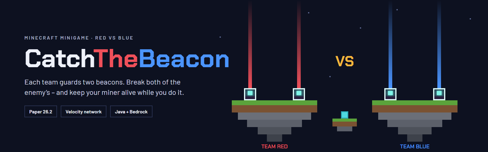
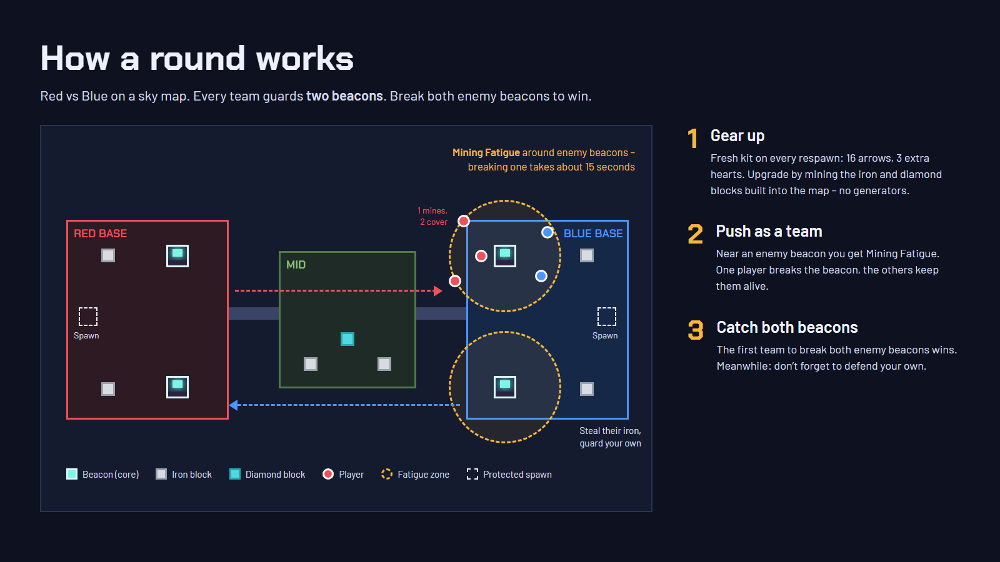

# CatchTheBeacon

A **Cores** minigame for Paper: **Red vs Blue on a sky map, every team guards two beacons (cores).** Break both enemy beacons
to win – but near an enemy beacon you get Mining Fatigue, so one player mines while the rest of the team keeps them
alive.

## Where to start

- **[Getting started](getting-started.md)** – install the plugin and play your first round in a few minutes
- **[How a round works](gameplay.md)** – lobby, teams, beacons, resources, events, the end of a round
- **[Arenas and maps](arenas.md)** – map presets, your own maps, the guided setup
- **[Join signs and NPCs](signs-and-npcs.md)** – let players join with a click
- **[Configuration](configuration.md)** – every option of `config.yml`
- **[Commands and permissions](commands.md)** – everything under `/ctb`

## Requirements

- **Paper 26.2** – only the current version is supported (forks of Paper like Purpur work too)
- **Java 25**

## Downloads

- [Modrinth](https://modrinth.com/plugin/catchthebeacon)
- [Hangar](https://hangar.papermc.io/Christian34/CatchTheBeacon)
- [SpigotMC](https://www.spigotmc.org/resources/catchthebeacon.139388/)
- [GitHub releases](https://github.com/itsthechris07/CatchTheBeacon/releases)

Found a bug or have an idea? Open an [issue on GitHub](https://github.com/itsthechris07/CatchTheBeacon/issues).
